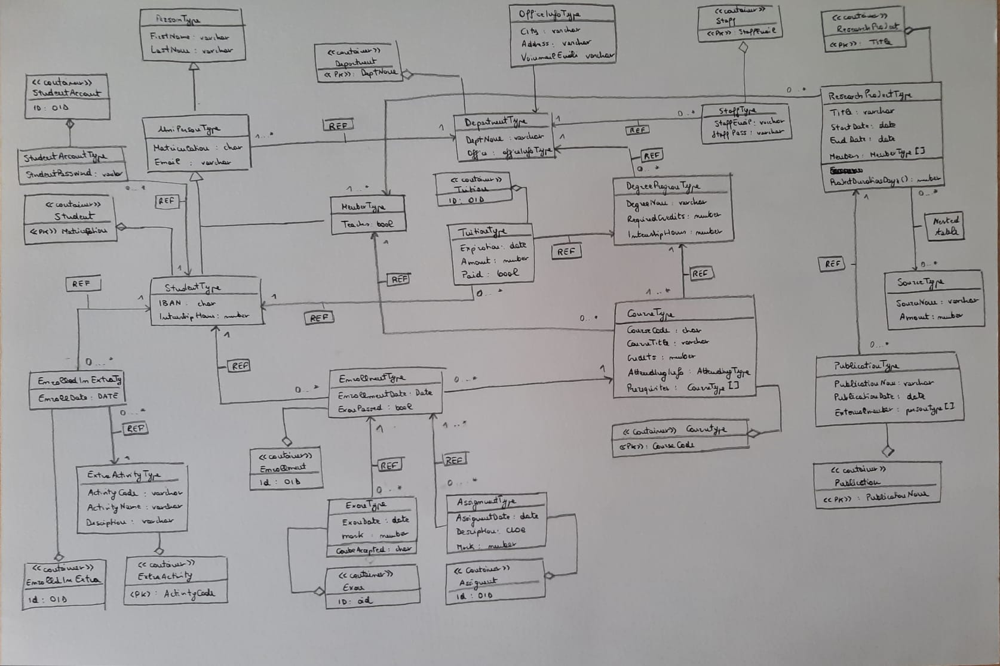

## Emanuele Tanzi - matr. 807406
### Database System a.y. 2023/24
# UniDidattica

In this respsitory I stored all files produced in the implementation of the database schema Unididattica.

## Logical schema

The creation of the logical schema started with the conceptual and logical design of the database. The last step of the logical schema can be summarized in the UML Class Diagram I reported in this repository.

## Schema creation

I realized the database using SQLDeveloper. I produced some .sql script files associated to each step of the creation of the database. Since this script files have been produced separately from the database on SQLDeveloper, I inserted into the repository also a [dump](UnididatticaDump.sql) of the database itself.

In this section I'll discuss the content of the singular files inside the folder [/SQLScripts](SQLScripts). They are included in the readme.md file in the numbered order to avoid problems of missing component definitions that were defined later in the database. They are:

1. ### UnididatticaUser.sql

In the file [SQLScripts/UnididatticaUser.sql](SQLScripts/UnididatticaUser.sql), toghether with the definition of the user (performed as system), there is also a list of `GRANT` assigned to be able ot perform the actions of creating and manipulating schema elements by the created user (C##UNIDIDATTICA).

2. ### CreazioneTipi.sql

In the file [SQLScripts/CreazioneTipi.sql](SQLScripts/CreazioneTipi.sql), i created all the useful types for the implementation of the specifics. In particular, they are presented in the order of creation (necessary to grant consistency to the operations, since many of them contains `REF` to other types).

- There is some inheritance, for example I introduced the *PersonType* as a parent of *UniPersonType*, that it is furtherly the supertype of the two subtypes *MemberType* and *StudentType*.
- I had to create types as array in some instances, for example to repesent the Prerequisites in *CourseType*, that is a list of courses associated to a single course, I have created the type *CourseArrayType*.
- Considering nested tables, I created *SourceTableType*, representing the source of founds given from any entity for a univeisity project.

3. ### CreazioneTabelle.sql

In the file [SQLScripts/CreazioneTabelle.sql](SQLScripts/CreazioneTabelle.sql), there is the creation of the tables associated to some of the previously defined types, following the specifications of the logical schema. Here, I defined the `PRIMARY KEY` and `NOT NULL` constraints. I implemented other referential integrity constraints with triggers.

4. ### IndiciSequenze.sql

Foreseeing some of the most common operations to be performed on the database (in particular, contextually with the design of some views, procedures and functions) I decided to introduce few indexes in the file [SQLScripts/IndiciSequenze.sql](SQLScripts/IndiciSequenze.sql). 

- I introduced indexes on some data values to facilitate comparison operations, performed in some controls.
- Some operations use course title instead of course code (that is the primary key of the Course table), so I decide to introduce the corresponding index.
- For Students and Members, since Name and Surname are important information on which `SELECT` operations can be performed, I decided to introduce the corresponding index.
- I introduced a Sequence, used in the random amount insertion in the procedure for the population of the tuitions in Tuition table.

5. ### ProcedureFunzioni.sql

I decided to incorporate all the procedure and sequences (excluding the procedures for the population of the tables) in the single .sql file [SQLScripts/ProcedureFunzioni.sql](SQLScripts/ProcedureFunzioni.sql) because some procedures can be called by some functions and vice versa. So, I ordered in the file the operations trying to respect the correct order of definition. Here, i consider important to describe the behavior of the single procedures and functions:

- **CheckUnpaidTuition**: this procedure is used to check if a student (specified by a matriculation number) has some expired tuition. Here is also defined a `CURSOR`, allowing to extract in the loop the informations about the amount and the expiration date for each corresponding tuition.
- **CreateExamForEnrollment**: I thought could be useful to automatically compute a Exam mark by computing the average mark of the assignment associated to the same enrollment. So, the procedure performs an insertion after the computation of the mark and the selection of the date inside the Exam table.
- **DeleteAssociatedEnrollments**: eliminate a Enrollments associated to a student.
- **GetMatriculations**: useful in the automatic population of some tables involving UniPersons. Uses the MatriculationArrayType, that represents the output of the procedure getmatriculations. There are two procedures with the same behavior (**GetMatriculationsMed**, **GetMatriculationsInf**), created with the only purpose to facilitate some insertion operations.
- **GenerateRandomEmail**, **GenerateRandomMemberEmail**: for automatic generation of emails
- **PrintProfessorWithMostCourses**: procedure retrieving the informations about the member which teaches in the greatest number of courses.
- **GetResearchProjects**: this is a function retrieving a cursor, on elements of the type ResearchProject, ordering them on the base of their duration (in terms of days). This function is called in the procedure **PrintResearchProjects**.
- **PrintResearchProjects**: The procedure printing the values fetched from the cursor.
- **CheckPrerequisiteFunction**: Returns a character between 't' and 'f', its purpose is to declare if a student has the right prerequisites for enrolling to a course.
- **CreditsObtained**: Computes the number of credits obtained by a specific student in input.
- **GetDepartmentByEmailAndPassword**: a function for utility, allowing to find the department of a staff member searching with the email and the password.
- **MembersPerDepartment**: a function that counts the number of members being part of a department in input.
- **StudentsPerCourse**: a function that counts the number of students being part of a department in input.

6. ### ProceduresForPopulation.sql

In the file [SQLScripts/ProceduresForPopulation.sql](SQLScripts/ProceduresForPopulation.sql) there are few procedures for the population of some of the most voluminous tables (*Student*, *Member*, *Tuition*). As previously said, some of them uses procedures/functions defined before. The defined procedures are:
- **PopulateStudent**
- **PopulateMembers**
- **PopulateTuition**
- **PopulateTuitionMed**

7. ### InsertTabelle.sql

[SQLScripts/InsertTabelle.sql](SQLScripts/InsertTabelle.sql) contains a list of `INSERT INTO` operations. There is also the execution of the functions defined in *ProceduresForPopulation.sql*.

8. ### DefinizioneViste.sql

The file [SQLScripts/DefinizioneViste.sql](SQLScripts/DefinizioneViste.sql) presents all the views defined in this DB. Some of them were created to facilitate the creation of the webapp (operations like `REF` and `DEREF` are not allowed), and these are:
- **CourseEnrollmentView**
- **DegreeProgramView**
- **DepartmentOfStafferView**
- **DepartmentRefView**
- **EnrollmentsOfStudentView**
- **ExamByStudentView**
- **StudentCredentialsView**

Other views have been defined to facilitate the execution of some select operations that can be commonly performed:
- **PrintNotActiveStudentView**: prints students enrolled for a course that have not performed neither exams nor assignments for that course.
- **PrintNotEnrolledStudentExamsView**: for finding the students not having performed any enrollment since at most the past year.
- **PrintStudentInComplianceView**: for finding the students in compliance with the payments

9. ### DefinizioneTrigger.sql

The file [SQLScripts/DefinizioneTrigger.sql](SQLScripts/DefinizioneTrigger.sql) contains all the triggers creations. Following, I'll briefly explain the meaning of each trigger
- **CheckAttendingValues**: allows to not insert attending values out of the domain.
- **CheckCourseDepartment**: it does not allow to insert teachers for a course that is not of the same department.
- **CheckCreditCoherence**: a upper bound to teh value Credits on Course table.
- **CheckDateCoherence**: for research projects, prohibits the insertion of projects having a start date that follows the end date.
- **CheckExamDateCoherence**: for exams, prohibits the insertion of a data being precedent to the data of enrollment.
- **CheckExamMarkCoherence**: impose a domain over the marks allowed (from 1 to 31).
- **CheckExamPassedCoherence**: impose to the values of Enrollment.ExamPassed to be 't' or 'f'.
- **CheckIfSameDepartment**: it does not allow to insert enrollments for a couple course-student not being part of the same department.
- **CheckPrerequisites**: before the insertion of an enrollment, it is necessary to verify that a student, if the course presents some prerequisites, have previously passed all the exams corresponding to that prerequisite.
- **CheckPrerequisitesDegreeProgram**: checks that the prerequisite exams are of the same degree program of the exam inserted itself.
- **CheckTuitionCoherence**: Similar to CCheckExamPassedCoherence, constraints the possible values for Tuition.Paid.
- **IsNowTeaching**: after the creation of a course, if the member inserted as a teacher was not previously a teacher, its flag in the Member tables becames 't'.
- **ModifyCourseNullPrerequisites**: this trigger corrects the possible mistake that can be performed caused by my definition in the Course table of Prerequisites, since many operations are performed on this array, and transforms all the `NULL` values inserted in the place of Prerequisites into an empty array of CourseArrayType.
- **NotDoubleInsertionInEnrollment**: does not allow a tuple inside Enrollment table to have the same couple (course, student).
!!! this trigger causes mutating tables issue
- **NotDoubleInsertionInExtra**: does not allow a tuple inside EnrolledInExtra table to have the same couple (course, student).

Moreover, the following triggers have been added since despite the `NOT NULL` connstraint and the `REF` relationships, the elimination of some tuple being referenced by another table does not cause the elimination of the corresponding tuple in the table which references it.
- **DeleteAssignmentAfterEnrollment**
- **DeleteCourseAfterDegreeprogram**
- **DeleteDegreeProgramAfterDepartment**
- **DeleteEnrollmentAfterStudent**
- **DeleteExamAfterEnrollment**
- **DeleteMemberAfterDepartment**
- **DeleteStudentAdterDepartment**
- **DeleteTuitionAfterDepartment**
- **DeleteTuitionAfterStudent**

10. ### GestioneStudentiUser1.sql

Eventually, I taught to the possibility of having a different user to access the components defined by UNIDIDATTICA. So, i created the user GESTIONESTUDENTI, giving different levels of grants over the resources.
The file [SQLScripts/GestioneStudentiUser1.sql](SQLScripts/GestioneStudentiUser1.sql) contains its creations that must be performed by system.

11. ### GestioneStudentiUser2.sql

In the file [SQLScripts/GestioneStudentiUser2.sql](SQLScripts/GestioneStudentiUser2.sql), we continue the definition of the user GESTIONESTUDENTI. In particular, there are the grants that can be given by UNIDIDATTICA user itself.

## UniDidatticaWeb

After the realization of the database schema, I also produced a simple web application, in Java, by exploiting the JDBC, allowing to perform a set of simple operations, using Apache Tomcat (version 9.0.89). In the repository, I shared both the [folder](UniDidatticaWeb) containing the web application project and the [.war file](UniDidatticaWeb.war). Following, I'll briefly discuss the servlets I included in the project:

1. #### AccessServlet

Allows the user to choose between the two options of access: access as a student or a staff member. 

2. #### UserLoginServlet

If the user choose to access as a student in AccessServlet, there it will be asked for the email and password for accessing its homepage. The correctness of the data inserted are checked by acceding to the table StudentAccount, whose access is granted by the view *StudentCredentialsView*). The correct insertion of data will conduct to the user homepage.

3. #### StaffLoginServlet

If the user choose to access as a staff member in AccessServlet, there it will be asked for the email and password for accessing the homepage of the department. 

4. #### UserHomepageServlet

After a correct insertion of email and password, this servlet allows the user to choose what action to perform after access. In this project, the available actions are accessing to its courses or accessing to its tuitions. 

5. #### EnrollmentServlet

After accessing to courses from the user homepage, here are shown the courses to which the student is enrolled, with some correlated information. It also allows to access to the records realated to the exams of that course, by clicking on the corresponding button.

6. #### TuitionServlet

Accessed by a student from the homepage, after clicking on payments option. Tuitions information must be accessed directly from the information we have of the student (the email), so we use the view *StudentTuitionsView* to access those information.

7. #### ExamDetailsServlet

After having clicked on the button corresponding to exams in enrollments, it shows all the records corresponding to singular exams with the correlated informations. To access information related to exams of a student for a specific course, I used the view *ExamsByStudentView*.

8. #### StaffHomepageServlet

This page prints out all the programs being part of the Department to which the staffer belongs. The information about the department of the staffer is stored in the table Staff, with a `REF` to the taable Department. So, it is used the view *DepartmentOfStafferView* to access this information.
The corresponding page also presents a button allowing the staffer to add a new program to the department.

9. #### InsertProgramServlet

Shows fields to compile for creation of a new program. If acceptable values are inserted, then the insertion is successfully completed. Since the INSERT operation requires to define all the values for each column, I needed to find back the department to which the staffer belongs, so i again used the view *DepartmentOfStafferView*.

